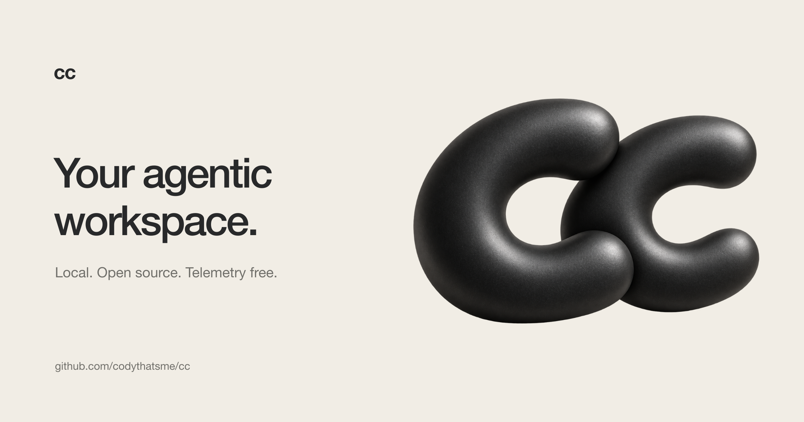

<p align="center">
  <picture>
    <source media="(prefers-color-scheme: dark)" srcset="assets/cc-logo-white.png">
    
  </picture>
</p>

# cc

A personal, telemetry-free fork of [bb](https://github.com/get-bb/bb), an agentic IDE with a desktop app, web UI, CLI, and HTTP API. cc uses the provider CLIs you already have authenticated.

<p align="center">
  
</p>

## Install with Homebrew

On an Apple Silicon Mac running macOS 13 or later:

```bash
brew tap codythatsme/tap
brew install --cask cc
open -a cc
```

You can also install directly with `brew install --cask codythatsme/tap/cc`.
Update with `brew upgrade --cask cc`. Homebrew installs `cc.app` in `/Applications`;
it does not replace the system C compiler command `/usr/bin/cc`.

The initial release is not Apple-notarized. If macOS blocks the first launch,
open **System Settings → Privacy & Security → Open Anyway** for cc.
The cask does not disable Gatekeeper or remove quarantine attributes.

The fork uses its own application identity and `~/.cc` data directory. It does not
migrate or overwrite an existing bb installation. Hosted connection services and
external marketplaces require explicit configuration. npm distribution is not
published for this fork; use Homebrew or build from source.

See [release maintenance](docs/releasing-cc.md) for building and updating the tap.

### Privacy

cc does not collect usage telemetry, installation identifiers, click events, or
crash reports. The server and website reporting implementations are removed;
there is no setting or environment variable that enables them. Better Auth's
transitive telemetry implementation is also removed by a dependency patch.

Model providers still receive the requests you send to them. cc disables the
supported analytics and telemetry controls for the Claude Code and Codex
processes it launches. Other third-party providers and plugins follow their
own privacy policies.

## Development

Use the development loop when working on cc itself:

```bash
pnpm dev
```

That starts the Vite app and proxies API and WebSocket traffic to a separate
dev server. The launcher prints the actual ports at startup. Each checkout gets
a data directory under
`~/.cc-dev/<checkout-instance>/` and deterministic high ports derived from the
checkout path. The checkout instance id is the sanitized path to the checkout,
relative to your home directory, plus a short hash suffix. Separate worktrees
can run alongside each other and the Homebrew desktop instance.

To test the production bundle and serving path without switching to production
data or ports, use:

```bash
pnpm start:worktree
```

This builds the same optimized frontend and runtime artifacts as `pnpm start`,
then serves the app from the CC server on the checkout-specific dev server port.
It keeps the normal checkout-specific dev data directory and host-daemon port.
There is no Vite dev server or hot reload in this mode; rerun the command after
source changes.

For the Electron desktop shell, keep `pnpm dev` running and start the desktop
package in a second terminal:

```bash
pnpm exec turbo run dev --filter=@cc/desktop
```

The desktop shell connects to this checkout's running dev app. Stop each command
with Ctrl-C in its terminal.

To use the dev app from another machine over Tailscale, run `pnpm dev`, note the
printed app port, and publish the loopback Vite listener:

```bash
tailscale serve --bg --https=443 http://127.0.0.1:<app-port>
```

Then open `https://<machine>.<tailnet>.ts.net`. Source dev binds both the Vite
app and main server to loopback by default; Vite continues to proxy API and
WebSocket traffic.

For direct access at `http://<tailscale-ip>:<app-port>` instead, run:

```bash
pnpm dev:remote
```

This binds the Vite app and main server to all IPv4 interfaces. The remote
browser must be able to reach both the printed app and server ports for realtime
updates. The server API is unauthenticated and permits command execution and
file reads, so use this only behind a trusted network boundary and restrict the
ports to Tailscale traffic with the host firewall when the LAN is not trusted.

To access the production-style worktree server directly from another machine,
run:

```bash
pnpm start:worktree-remote
```

This uses the same checkout-specific data directory and ports as
`pnpm start:worktree`, but binds its single server listener to all IPv4
interfaces. The server API is unauthenticated and permits command execution and
file reads, so use it only behind a trusted network boundary and restrict the
port to Tailscale traffic with the host firewall when the LAN is not trusted.

To use the component storybook from another machine, run:

```bash
pnpm storybook
```

Ladle binds to all interfaces and configures its HMR WebSocket to use the
browser's current host instead of `localhost`. Do not run `pnpm storybook` on an
untrusted network.

Development behavior is intentionally split:

- the app hot reloads itself
- the server does not hot reload
- the host daemon does not hot reload

When you want the server and host daemon to pick up the latest build output, use:

```bash
pnpm dev:restart
pnpm dev:restart-server
pnpm dev:restart-host-daemon
```

These rebuild first, then restart only the targeted stateful services.

To run a production-mode build from a source checkout:

```bash
pnpm start
```

That builds only the app, server, and host-daemon runtime artifacts, then runs
the launcher directly against those workspace outputs. Use the `cc-app`
tarball smoke task when validating the bundled runtime package layout.

```bash
pnpm cc --help            # built CLI, targets the default/prod instance
pnpm reset                # clear production state

pnpm cc:dev --help        # source CLI, targets this checkout's dev instance
pnpm reset:dev            # clear this checkout's dev state

pnpm reset:all            # clear both production and dev states
```

These reset commands prompt for confirmation before deleting anything.

## Repository Overview

See [Repository overview](docs/repository-overview.md) for the monorepo package and app map.

## System Overview

See [System overview](docs/system-overview.md) for runtime architecture, data model, and component boundaries.

## Further Reading

- [Vision](docs/VISION.md)
- [Platform support](docs/platform-support.md)
- [Configuration](docs/configuration.md)
- [Using cc on multiple devices](docs/multiple-devices.md)
- [Worktrees and setup scripts](docs/worktrees.md)

## Contributing

See [CONTRIBUTING.md](CONTRIBUTING.md) for contribution guidelines.

## Troubleshooting

For a desktop install, use `brew reinstall --cask codythatsme/tap/cc` to restore
the tested native modules. For source development, use the Node version in
`.nvmrc`, run `pnpm install --frozen-lockfile`, then `pnpm ensure-native-modules`.
Do not reuse native modules built for a different Node version or architecture.

## Acknowledgements

cc is derived from [bb](https://github.com/get-bb/bb). The original project's MIT
copyright and permission notice are preserved in [LICENSE](LICENSE).
